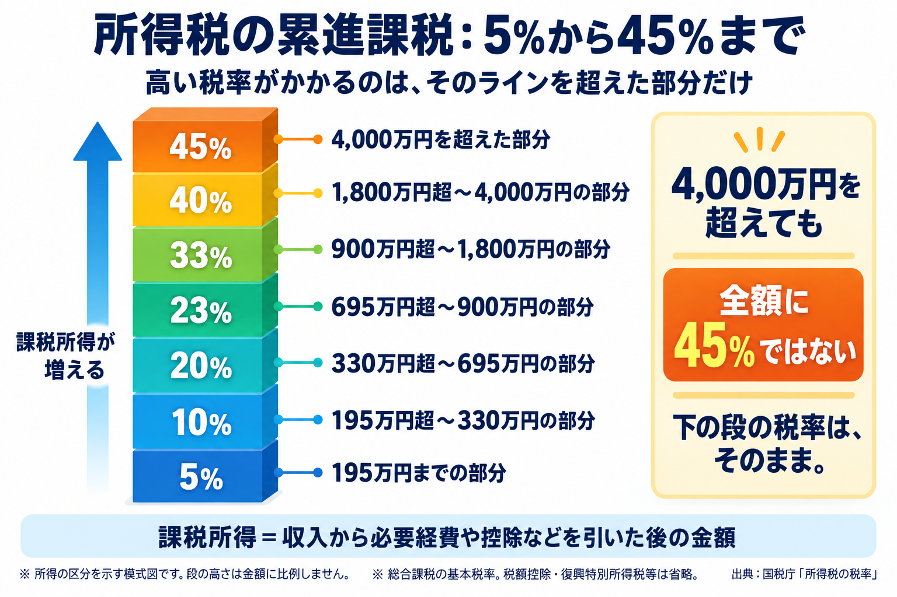
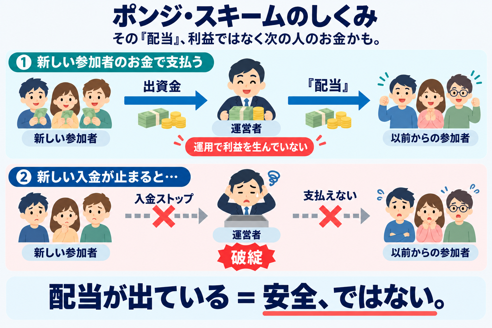
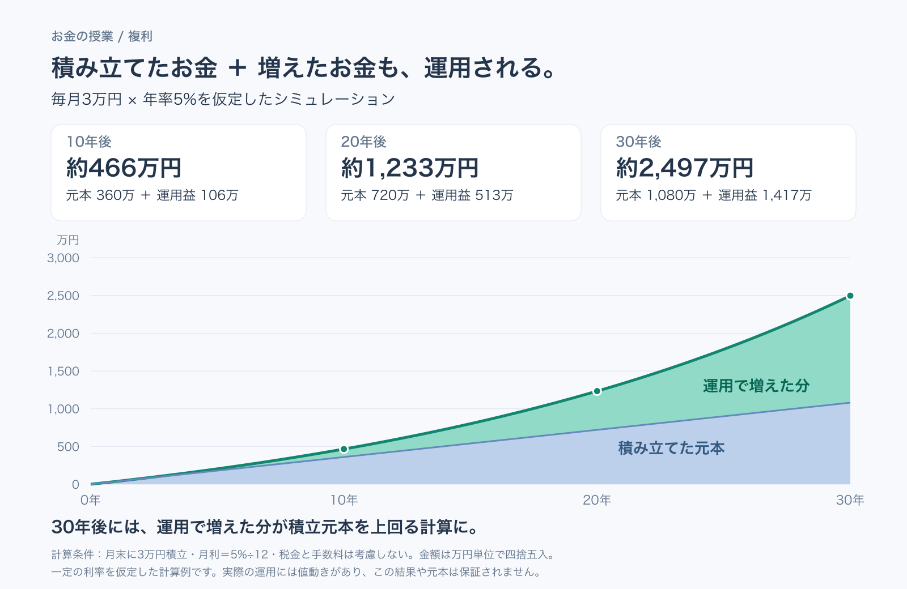
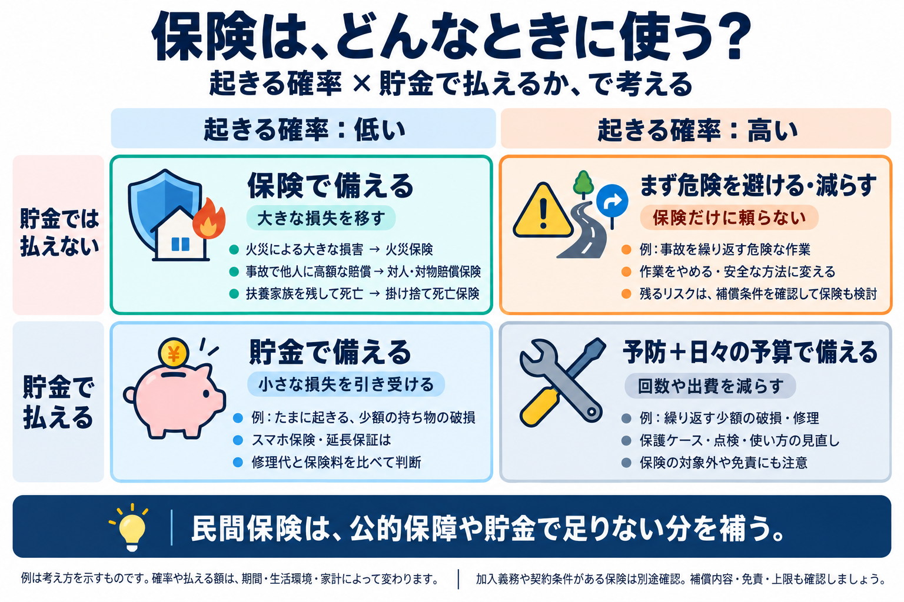

# 番外編: お金の授業（手取り・詐欺・複利・NISA・保険）

- 日付: 未定
- 分類: 番外編
- 完了: [ ]
- Notion: 未作成

---

## この回でやること

就職すると、誰も教えてくれないまま「税金が引かれた給料」「保険の勧誘」「投資の話」がいきなり来る。そのときに**知ってるか知らないかで数十万〜数百万円変わる話**を、ざっくり共有する回。

細かい制度や数字は覚えなくていい。「これは気をつける」「これはやっておく」だけ持ち帰って、詳しくは必要になったときに調べればOK。

> 講師は税理士でもFPでもないので、個別の相談や「この商品買え」はなし。制度は毎年変わるので、実際にやるときは公式サイトで確認すること。

## 目次

- [導入: これ、どれが詐欺？](#導入-これどれが詐欺10分)
- [1. 手取り](#1-手取り--年収400万は400万もらえない)
- [2. 詐欺](#2-詐欺--年利の相場を知ってれば30秒で見抜ける)
- [3. インフレ](#3-インフレ--なぜ投資するのか)
- [4. 複利](#4-複利--時間が最強の武器)
- [5. 投資とNISA](#5-投資とnisa--普通はこれ)
- [6. 保険](#6-保険--ほとんど要らない)
- [7. 確定申告](#7-確定申告--フリーランス副業やるなら)
- [8. ふるさと納税](#8-ふるさと納税--社会人になったらやる)
- [チェックリスト](#チェックリスト)
- [9. 両学長 / リベラルアーツ大学](#9-両学長--リベラルアーツ大学--もっと知りたくなったら)
- [参考](#参考)

## 導入: これ、どれが詐欺？（10分）

4つの勧誘文句、乗る？乗らない？直感で答えてみて。答えは2章のあと。

1. 「元本保証・月利3%・友達を紹介するとボーナス」
2. 「AIが自動売買、年利30%、実績のスクショあり」
3. 「信託報酬0.1%の全世界株インデックス、元本保証なし」
4. 「毎月分配型で分配金利回り12%」

## 1. 手取り — 「年収400万」は400万もらえない

**知っておくこと**

- 求人票の「月給25万」は**額面**。手取りは**だいたい8割**の20万くらい
- 引かれてるのは税金と社会保険。**社会保険のほうが税金より高い**

**累進課税**

所得税は、課税所得の各部分に5%〜45%の税率が段階的にかかる。**5%から45%までの7段階**を図にすると、こんな仕組み。

※ 所得を分ける仕組みの模式図。税額控除・復興特別所得税・住民税・社会保険料は含まない。税率の全区分は[国税庁「所得税の税率」](https://www.nta.go.jp/taxes/shiraberu/taxanswer/shotoku/2260.htm)を参照。

- 新卒の年収300〜400万なら、控除を引いた課税所得は200万前後。**ほぼ5〜10%の世界**
- 高い税率がかかるのは**ラインを超えた分だけ**。所得税の税率が上がることだけで、増えた所得以上に税金が増えるわけではない
- 別に住民税が一律10%乗る

**会社員とフリーランスの違い**

| | 会社員 | フリーランス |
| --- | --- | --- |
| 税金・保険の払い方 | 給料から**天引き**。会社が年末に精算してくれる | **全部自分で計算して払う**（確定申告） |
| 健康保険・年金 | 会社が**半分負担**してくれる | **全額自己負担** |
| 経費 | 自動で一定額引かれる | 使った分を自分で記録して引く |

- フリーランスは**売上＝手取りじゃない**。税金・国保・年金を払う前の額なので、**売上の3割くらいは別口座に分けておく**
- 会社員は会社が半分持ってくれてる分、同じ額面ならフリーランスより手取りは多い。独立するときは額面の比較だけで判断しない

**学生バイトの「年収の壁」**

- 壁は2種類。**税金の壁**（親の扶養が外れる）と**社会保険の壁**（自分で健保・年金を払う）
- 痛いのは社会保険の壁のほう。税金の壁はちょっと超えても手取りが逆転することはほぼない

## 2. 詐欺 — 年利の相場を知ってれば30秒で見抜ける

**これだけ覚えておく**: 世界中のプロが本気で運用して**年5〜7%**。

| だいたいの相場                     | 年利                          |
| ---------------------------------- | ----------------------------- |
| 銀行預金                           | ほぼ0%                        |
| 全世界株のインデックス（長期平均） | **5〜7%**、マイナスの年もある |
| リボ払い・カードローン（払う側）   | **15%前後**                   |

だから「元本保証で月利3%（年利36%）」は、プロの数倍をノーリスクで、なぜか無名の自分にくれるという話。**まずありえない**。

**ポンジ・スキーム**: 運用なんてしてなくて、**新しく入った人の金を古い人に「配当」として渡してるだけ**。最初は本当に配当が出るから信じた人が友達を連れてくる。新規が止まった瞬間に飛ぶ。構造上、必ず飛ぶ。

**1つでも当てはまったら関わらない**

- **元本保証**と**高利回り**を同時に言う
- 「月利◯%」「確実に」
- **紹介したら報酬**（友達・先輩・SNSの知り合い経由で来る）
- 中身を説明できない。「AIが自動で」「海外の特別ルート」
- 「今だけ」「あなただけ」「秘密にして」
- 出金しようとすると渋る

**やっておく**: 業者名を[金融庁の警告リスト](https://www.fsa.go.jp/ordinary/chuui/index.html)で検索。30秒。

> 若手社会人は狙われる側。「久しぶりに同級生から連絡→カフェで先輩を紹介される」は鉄板パターン。断りにくかったら「親に相談してから」と言って持ち帰る。**まともな話なら持ち帰られても困らない**。

**クイズの答え**

- 1: 元本保証＋高利回り＋紹介報酬。3アウト
- 2: 年利30%＋中身不明。スクショは何の証明にもならない
- 3: **これはまとも**。「元本保証なし」と正直に言ってるのがむしろ健全
- 4: 相場の2倍を毎月配る＝元本を削って配ってる可能性大

## 3. インフレ — なぜ投資するのか

**インフレ** = 物の値段が上がること = 同じお金で買えるものが減ること。

- 年2%のインフレが続くと、100万円で買えるものは10年後に約82万円分、30年後に約55万円分になる
- 日本もここ数年は年2〜3%上がってる。給料が同じだけ上がるとは限らない
- 銀行預金はほぼ0%なので、現金は「減らない」んじゃなくて**じわじわ目減りしてる**
- 次の章の72の法則はインフレにも使える。年3%なら**24年でお金の価値が半分**

**だから投資する**

投資は「儲けるため」というより、**インフレに負けないため**にやる。

- 物の値段が上がる = 物を作って売ってる会社の売上も上がる。株を持つ = その会社の一部を持つ、なので**株はインフレと一緒に上がりやすい**
- 株のインデックスが長期で年5〜7%と言われるのは、インフレ分（2〜3%）込みの数字。**貯金だけの人との差はここから開いていく**
- 「投資は怖い」は正しい。でも**現金だけ持ってるのも、目減りするという意味ではリスク**。どっちもリスクなら、長期で見て増えやすいほうに一部を置く、という考え方

ただし全部投資に回すわけじゃない。生活防衛資金は現金で持つ（5章）。**余ったお金を貯金のまま寝かせておかない**、が持ち帰るポイント。

## 4. 複利 — 時間が最強の武器

**複利** = 増えた分にもさらに利息がつく。時間が経つほど加速する。

**72の法則**: `2倍になる年数 ≒ 72 ÷ 年利`

- 年利6% → 12年で2倍
- 年利3% → 24年で2倍
- 逆に「年利36%」は「2年で倍」と言ってるのと同じ。この時点で怪しいと気づける

**毎月3万円を年利5%で積み立てると（ざっくり）**

| 期間 | 元本    | 最終額    |
| ---- | ------- | --------- |
| 10年 | 360万   | 約470万   |
| 20年 | 720万   | 約1,230万 |
| 30年 | 1,080万 | 約2,500万 |

30年だと**増えた分（1,400万）が元本より大きい**。効くのは利率じゃなくて**年数**。だから20代で始めるのが一番強い。

※ 毎年きっちり5%増えるわけじゃない。上下しながら平均でこのくらい、保証はない。

> 自分で計算してみたい人: [課題: 複利シミュレーターをReactで実装](課題_複利シミュレーター.md)
> 参考: https://claude.ai/share/2cfe53b5-822d-4398-8684-8bce6d0c2db6

## 5. 投資とNISA — 「普通」はこれ

**投資する前にやること（順番大事）**

1. 生活費3〜6か月分を現金で貯める
2. リボ・カードローンがあれば先に返す（年15%の損失を止めるのが最強の投資）
3. 余った金で投資

順番を守らないと、暴落時に生活費が必要になって一番悪いタイミングで売るはめになる。

**初心者の「普通」は1行**: **低コストのインデックスファンドを、毎月定額で、長く積み立てる**

- インデックスファンド = 何千社の詰め合わせ。全世界株（オルカン）かS&P500が定番。1社潰れても死なない
  - SBI証券で人気なのはこの2本。チャートは運用会社の公式ページで見られる: [eMAXIS Slim 全世界株式（オール・カントリー）](https://emaxis.am.mufg.jp/fund/253425.html)／[eMAXIS Slim 米国株式（S&P500）](https://emaxis.am.mufg.jp/fund/253266.html)
  - どっちにするか迷ったら: [NISAでオルカン・S&P500、どっちを選ぶ？（SBI証券）](https://go.sbisec.co.jp/media/report/nisa_dojo/nisa_dojo_251225.html)
- 手数料（信託報酬）は年0.1%台のやつ。1%超えは30年で数百万の差になる。**手数料だけは自分でコントロールできる**
- 個別株・FX・暗号資産・不動産は最初は手を出さないほうがいい

**「毎月定額」の理由 = ドルコスト平均法**

同じ金額を、値段に関係なく毎月買い続けるやり方。値段が高い月は少ししか買えず、安い月はたくさん買える。結果として**平均の買値が自然と下がる**。

| 月 | 1口の値段 | 毎月1万円で買える口数 |
| --- | --- | --- |
| 1月 | 10,000円 | 1口 |
| 2月 | 5,000円（暴落） | 2口 |
| 3月 | 10,000円（戻った） | 1口 |

3万円で4口。1口あたり**7,500円**で買えたことになる。値段は最初と同じなのに、持ってる分は4万円分。**暴落が「安く仕込めた月」に変わる**。

- 「いつ買えばいいか」を考えなくていい。**買い時を当てられる人はいない**ので、当てるのをやめる
- 暴落が来ても「安く買えてラッキー」と思えるので、怖くなって売る、という一番の失敗を避けやすい
- 給料から毎月一定額を回す人は、勝手にこの形になる。設定したら**あとは見ない**のがコツ
- ただし魔法ではない。右肩上がりの相場では最初に一括で買ったほうが結果は良いし、下がり続ける物を買い続ければ損する。**「長期で上がると思える物（インデックス）」を「機械的に買う」**、この2つセットで初めて意味がある

**NISA** = 投資の利益にかかる**約20%の税金がゼロになる口座**。

- ネット証券で口座作って、上のインデックスファンドを積み立てるだけ
- 上限（年360万・生涯1,800万）はあるけど、20代の積立額なら気にしなくていい
- iDeCoは60歳まで引き出せないので、若いうちはNISA優先

> ⚠️ NISAは「口座の種類」であって儲かる商品じゃない。**NISAでも元本割れはする**。

## 6. 保険 — ほとんど要らない

**保険の考え方**: 「めったに起きないけど、起きたら貯金じゃ払えない」リスクは、保険で備える優先度が高い。まず公的保障を確認し、それでも足りない分を民間保険で補う。貯金で払える損失は、保険料と比べて自分で備える方法も考える。

- **低確率 × 払えない**: 火災保険、対人・対物賠償保険、扶養家族がいる場合の掛け捨て死亡保険などを検討。
- **高確率 × 払えない**: 危険な作業をやめる・方法を変えるなど、まず発生を避ける・減らす。残るリスクには保険も検討。
- **低確率 × 払える**: 少額の持ち物の破損などは貯金で備える。スマホ保険・延長保証は修理代と保険料を比較。
- **高確率 × 払える**: 繰り返す少額の破損などは、保護ケース・点検・使い方の見直しと日々の予算で備える。

※ 例の位置づけは期間・生活環境・家計によって変わる。加入義務や契約上必要な保険は別途確認し、補償範囲・免責・上限も確認する。

参考: [日本損害保険協会の教育テキスト「リスクマップの活用」](https://sonpo-textbook.jp/2025/textbook/basic/22)の4分類を、家計向けの例で図解。

**先に知っておきたい、公的保険は結構すごい**

- **高額療養費制度**: 医療費の自己負担は月10万円弱くらいで頭打ち。「がんになったら1,000万かかる」は営業トーク
- **傷病手当金**: 病気で働けない間、給料の2/3が最長1年半出る
- 死んだら遺族年金、障害が残ったら障害年金、仕事中のケガは労災。もう入ってる

**入る／入らない**

| 入っておく                                    | たぶん要らない                                                                 |
| -------------------------------------------- | ------------------------------------------------------------------------------ |
| 火災保険（賃貸でも）                         | 医療保険・がん保険（高額療養費制度＋貯金で足りる）                             |
| 自動車保険の対人・対物**無制限**             | **貯蓄型保険**（終身・学資・外貨建て）。手数料が見えにくく、途中解約で元本割れ |
| 掛け捨ての死亡保険（**扶養家族がいるなら**） | スマホ保険・延長保証                                                           |
| 自転車保険（自治体によっては義務）           |                                                                                |

**勧誘されたら3つ聞いてみる**: ①それ貯金で払えない額？ ②公的保険でどこまでカバーされる？ ③手数料いくら？ 答えられない人からは買わないほうがいい。

## 7. 確定申告 — フリーランス・副業やるなら

**会社員なら**: 会社が年末調整でやってくれる。基本なにもしなくていい。

**フリーランス・副業なら知っておくこと**

- 天引きしてくれる会社がないので、**自分で税金・国保・年金を払う**（1章参照）
- 副業の所得が**年20万超えたら確定申告**。20万以下でも住民税の申告は要る
- 業務委託の報酬は**10.21%先に引かれてる**ことが多い。確定申告すると戻ってくる。しないと戻らない
- **レシート・請求書は捨てない**。PC・ソフト・本・通信費は経費になる
- 会社に副業バレたくないなら、確定申告で住民税を「自分で納付」にチェック

**青色申告**: 開業するなら「開業届」と「青色申告承認申請書」を税務署に出しておく。書類2枚で控除が最大65万円増える。出し忘れた年は白色扱いで控除なし。

**ツール**

- 家計簿: **マネーフォワード ME**。銀行・カードを連携すると何にいくら使ったか勝手に見える。**学生のうちから入れておくといい**
- 事業の会計: **freee会計** か **マネーフォワード クラウド確定申告**。簿記知らなくても青色申告の書類まで作れる
- 会社員の医療費控除くらいなら国税庁の「確定申告書等作成コーナー」で十分

## 8. ふるさと納税 — 社会人になったらやる

- 実質2,000円で返礼品がもらえる。**節約じゃなくて「税金を払う場所を変えてるだけ」**
- **上限がある**。年収で決まる。超えた分はただの寄附。[目安表（鹿児島市PDF）](https://www.city.kagoshima.lg.jp/soumu/zeimu/shiminzei/shise/yosan/oensite/documents/koujyomeyasu.pdf)か各サイトのシミュレーターで確認
- **税金払ってない人がやると損しかしない**。学生のうちはやらない。社会人になって住民税を払うようになってから
- 寄附したら「ワンストップ特例」の書類を出す（5自治体まで）。翌年6月の住民税通知で減ってるか確認して完了

## チェックリスト

この回が終わったら答えられること。

- [ ] 額面と手取りの違い、会社員とフリーランスで何が違うか
- [ ] 株のインデックスの年利の相場
- [ ] 怪しい儲け話の危険信号を3つ
- [ ] 金融庁の警告リストで業者を検索できる
- [ ] なぜ投資するのか、インフレとからめて説明できる
- [ ] 72の法則で暗算できる
- [ ] ドルコスト平均法で、なぜ暴落を怖がらなくていいのか
- [ ] NISAって何がゼロになる口座？
- [ ] 保険に入るかどうかの3つの質問
- [ ] 自分は確定申告が要る人？
- [ ] ふるさと納税、今の自分はやるべき？

## 9. 両学長 / リベラルアーツ大学 — もっと知りたくなったら

この回の内容はだいたいここで無料で学べる。

- YouTube: [両学長 リベラルアーツ大学](https://www.youtube.com/@ryogakucho)
- 書籍: 『本当の自由を手に入れる お金の大学』（改訂版あり）

### 「5つの力」

1. **貯める** — 固定費（通信費・保険・家賃・車・サブスク）から削る
2. **稼ぐ** — 給与＋副業。**Web制作・デザインは副業にしやすい。我々はここが強い**
3. **増やす** — インデックス投資
4. **守る** — 詐欺・ぼったくりを避ける
5. **使う** — 貯めるのが目的じゃない

### 章ごとのおすすめ動画

「お金の授業 ○限目」は書籍を章ごとに解説するシリーズで1本10〜20分。まずこれ、深掘りしたければ「第○回」。

| 章                 | 動画                                                                                                                                                  |
| ------------------ | ----------------------------------------------------------------------------------------------------------------------------------------------------- |
| 1. 手取り          | [第43-1回 所得税と住民税とは？確定申告についても解説](https://www.youtube.com/watch?v=XsUydesjejw)                                                     |
|                    | [第54回 年収別の手取りと生活費を計算して気がついた5つの真実](https://www.youtube.com/watch?v=yLjefWe221o)                                             |
| 2. 詐欺            | [第382回 初心者が投資で勝つ方法 詐欺（ポンジスキーム）にあわない事](https://www.youtube.com/watch?v=DeaMhucwP4I)                                      |
|                    | [お金の授業 57限目 絶対にやってはいけない投資の一つ](https://www.youtube.com/watch?v=WoevZsMLeLk)                                                      |
|                    | [第61回 お金あげます詐欺に騙されるな](https://www.youtube.com/watch?v=RIaMvVGDT8c)                                                                     |
| 4. 複利            | [お金の授業 33限目 複利の力を知ろう](https://www.youtube.com/watch?v=m6hrxANlSOw)                                                                     |
| 5. 投資とNISA      | [お金の授業 36限目 NISA口座をフル活用しよう](https://www.youtube.com/watch?v=pY8slPUxo2s)                                                             |
|                    | [第235回 新NISAのココがスゴイ5選](https://www.youtube.com/watch?v=mEQDotS9Bp8)                                                                         |
| 6. 保険            | [お金の授業 5限目 保険を正しく見直そう](https://www.youtube.com/watch?v=zhBuR9GLedM)                                                                   |
|                    | [お金の授業 13限目 君の入っている○○保険は不要！](https://www.youtube.com/watch?v=2o0NQWGmc2Q)                                                          |
|                    | [第21回 コスパが良いおすすめの掛け捨て保険4選](https://www.youtube.com/watch?v=k2cc3nBq5kc)                                                           |
| 7. 確定申告        | [第56回 青色申告と開業届けの出し方](https://www.youtube.com/watch?v=RrTiyi0jdOI)                                                                       |
|                    | [第117回 確定申告を制するものは蓄財レースを制す](https://www.youtube.com/watch?v=oJnfQPKxNUo)                                                         |
| 8. ふるさと納税    | [お金の授業 26限目 ふるさと納税をしよう＆医療費控除を申請しよう](https://www.youtube.com/watch?v=oeK-pZKnk0s)                                         |
| 9. 5つの力・固定費 | [お金の授業 1限目 お金持ちの大原則を知ろう](https://www.youtube.com/watch?v=fTBvrAOyX20)                                                              |
|                    | [お金の授業 2限目 まずは固定費を見直そう！](https://www.youtube.com/watch?v=YgbMKJZjriw)                                                               |

- 通しで見るなら: [「お金の大学」書籍解説](https://www.youtube.com/playlist?list=PLpwLNivKud-gSBFd7Vk9xxIBWjMyOgcTo)／[お金の勉強 -初級編-](https://www.youtube.com/playlist?list=PLpwLNivKud-jSHTx8hArrxyUqmLgm1opb)
- リンクが切れていたらチャンネル内でタイトル検索

> ⚠️ 両学長に限らず、**1人の言うことを鵜呑みにしない**。この資料も同じ。数百万円動かす前に別の情報源と照らし合わせる。

## 参考

- [金融庁 無登録業者の警告リスト](https://www.fsa.go.jp/ordinary/chuui/index.html)／[登録業者一覧](https://www.fsa.go.jp/menkyo/menkyo.html) — 怪しい業者名をここで検索
- [金融庁 NISA特設ウェブサイト](https://www.fsa.go.jp/policy/nisa/)
- YouTube: [両学長 リベラルアーツ大学](https://www.youtube.com/@ryogakucho)／書籍『本当の自由を手に入れる お金の大学』
